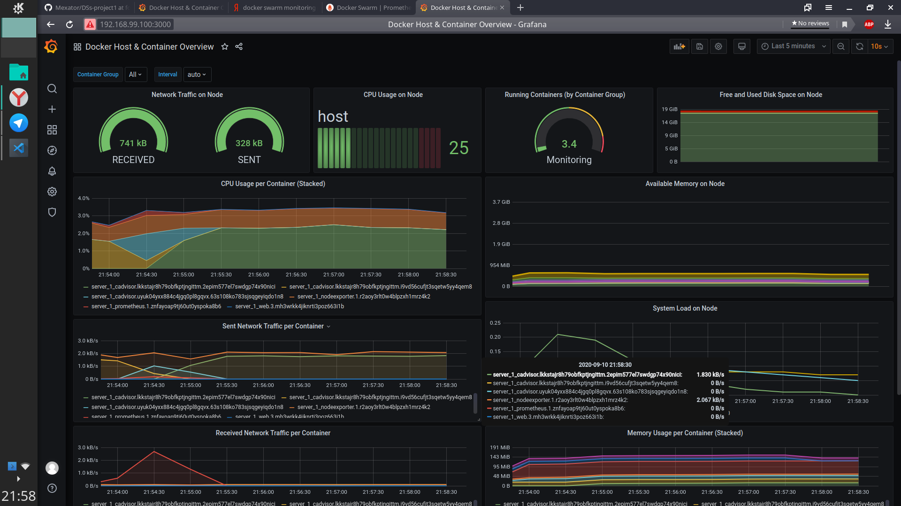

# Report for Distributed Systems Project 1.
Made by Anton Brisilin and Ruslan Israfilov

# Introduction
We decided to create service for load-testing of web services. The idea was 
to use swarm of containers on different hosts to create a bid load of network
traffic to a specified url or IP.  
Because of relatively short term, lack of experience, and other workload wo 
decided to make a first prototype to have all nodes independent. You can find
the project [here](https://github.com/Cendien/Load-Test/). Repository with 
report sources and intermediate answers to questions is available [there](https://github.com/Mexator/DSs-project1)

# Questions

## Question 1. What is Docker-machine and what is it used for?

`Docker-machine` is a tool that allow you to manage your remote servers and
make them a Docker hosts. `Docker-machine` allows to install Docker 
Engine to almost any physical machine running any OS by wrapping it into a 
virtual machine.
This tool allows quickly create cluster of Docker hosts.

## Question 2. What is Docker Swarm, what is it used for and why is it important in Containers Orchestration? 
`Docker Swarm` is a container orchestration tool. It allows the user to 
manage multiple containers deployed across multiple host machines.
In a `Docker Swarm`, there are typically several worker nodes and at least 
one manager node that is responsible for handling the worker nodes' resources 
efficiently and ensuring that the cluster operates efficiently. `Docker 
Swarm` is important in Container Orchestration, because it can let us 
efficiently manage our resources in our Distributed Systems.

## Question 3. Install Docker-machine, create a machine, etc.
- **Docker Machine drivers**  
In our operating systems we have VirtualBox and VmWare Workstation installed.
However last one [is not supported](https://docs.docker.com/machine/drivers/) 
by Docker, at list officially, so we decided to use VirtualBox driver.
We installed a docker-machine (that was easy - it is in AUR repositories, 
so we just ran `yay -S docker-machine`)
- **Docker-machine provisioning**  
Actually, we don't really understood what to write there. We just ran 
`docker-machine create --driver virtualbox Master` and that created the 
docker machine. Afterwards we could connect to it with `docker-machine ssh 
Master`
- **Experiment with some docker-machine commands**  
Yes, we did it. 😄 We tried almost whole list of available commands. However,
we don't think that it is necessary to write what each one does.

## Question 4. Create two Workers as well
Screenshot of `docker-machine ls`:


## Question 5. Deploy a true container cluster farm across many Dockerized virtual machines.

To make this happen I did following:
1. Ssh to master. 
 - List IPs, choose one of them
 - Issue `docker swarm init --advertise-addr 192.168.99.100`. This created a 
 swarm with Mater node as a leader.
 - Also that gave me an instruction of how to join workers.
2. Ssh to worker 1.
```
docker swarm join --token [my-token] 192.168.99.100:2377
``` 
3. Ssh to worker 2.
```
docker swarm join --token [my-token] 192.168.99.100:2377
``` 
4. Ssh to master (again). 
- `docker node ls`  
 That showed that all nodes are connected and Master see workers.  


## Question 6. How to promote worker to manager?
From the [Docker documentation](https://docs.docker.com/engine/swarm/admin_guide/):
> You manage swarm membership with the docker swarm and 
docker node subsystems.  

After looking into `docker node --help` we discovered that 
there are `promote` and `demote` parameters. They are used to
turn a manager node to a worker and vice versa. 

The requirements for promoting/demoting manager at the swarm 
are the same as for every command that manages the swarm:
There should be a _quorum_, i.e. majority of managers should 
agree on management changes.  
However, there are one more requirement - you can not demote 
last manager of the swarm. And, of course, only manager can 
promote/demote or somehow manage the swarm.

Now let's promote `Worker1` to be a manager. To do this we 
should execute `docker node promote Master`.  
This can be done 
by two ways: either connect to docker machine via ssh, and just 
execute the command, or use `eval $(docker-machine env Master)`
in your host console. The latter command will connect Docker 
Engine running on administrator's machine to remote (or local)
Docker machine.  

## Question 7. Deploy a simple Web page.
For this task we created a simple Flask server. You can see 
it at [`flask_app_task7`](flask_app_task7) folder. All it 
does - shows a hostname inside `<h1>` tag on a main page. We tested 
it locally, and now all we need to do - to run it on instances of 
our swarm.

First thing we need to do - push our image to any [Docker Registry](https://docs.docker.com/registry/)
available
from our swarm node. I chose DockerHub as a default choice for storing images.
So, we run `docker-compose up -d` to build all the images, and once they 
built we run `docker-compose push`. This will push all built images to their
registry.

Then, connected to the manager machine, we connected to manager node of 
the swarm and issue `docker stack deploy --compose-file=docker-compose.yaml 
server_1`. Obviously, we should have `docker-compose.yaml` at the directory
where we issue this.

That's it, we deployed a service to the swarm. However, there is only one 
replica of the service. To fix this, we need to modify our `docker-compose.yaml`, and add there 
```yaml
version: '3'
services:
  web:
    ...
    deploy: 
      replicas: 3
```
With that option, we will have 3 replicas of our `web` service. Now, we can 
re-deploy the stack by `rm`-ing it and `deploy`-ing again.  
Let's test it:  
<center>


</center>
As you can see, even queries to the same IP are processed at different nodes 
of Docker-swarm.

## Question 8. How to scale instances in the swarm?
To add more instances to a swarm one can use `docker swarm join` command. This is done just in the same way as we joined workers.

To run service on a newly added instances we can issue `docker service scale 
[service]=[number of nodes]` command. This will add more replicas of service.
By default, docker swarm equally distributes replicas across the swarm.   
However, when new node joins the swarm, it does not receive new tasks. It
is done in sake of saving consistent user experience. New tasks will be given
to idle nodes.

Autoscaling of swarm requires external tools, that will create docker-machines
and join them to the swarm. This can not be done using only docker swarm.

## Question 9. Validate that when a node goes down a new instance is launched.
Let's add more instances:
```shell 
docker service scale server_1_web=6
```

Now, let's kill Worker2, wait a few seconds, and check:

After several seconds Docker detects failed node and launches new instances 
on stable ones. It works!  
When dead node comes back, tasks [are not rebalanced](https://docs.docker.com/engine/swarm/admin_guide/#force-the-swarm-to-rebalance).  
Thus, we must run `docker service update server_1_web --force`. That will 
rebalance tasks across the swarm, giving part of them to newly returned 
Worker2.

## Question 10. Perform some update in your application
As a minor change, we decided to change color of a background. Previously it 
was black, and now - purple. Replicating them is pretty easy. We should just
rebuild images, with docker-compose, for example, then push changes to 
registry and finally re-deploy our stack.  
After some time, update will be propagated over all of the instances, and 
we'll see nice-looking purple background on the web-pages.  
<center></center>

## Question 11. Setup monitoring on the swarm.
We decided to use [Prometheus](https://prometheus.io/) & [Grafana](https://grafana.com/),
guided by [this article](https://dzone.com/articles/monitoring-docker-swarm).
So, we modified our docker-compose file, and... nothing worked. The service was
successfully deployed locally, but refused to work at remote docker-machines.  
After several hours of troubleshooting, we discovered that docker stack deploy
doesn't work with volumes over network. To workaround this, we created docker images
for every service we previously passed config to with volumes, and added there
only `FROM` and `COPY` commands.  
After this we imported some ready template to Graphana, and checked that everything works correctly by watching at the dashboard data.

> Could it be just CLI or maybe GUI?  
We didn't really understood this question, but there is no way for the 
monitor not to be a distributed application. The reason is simple - someone
should send metrics from containers and nodes to a monitor service.

## Question 12. Out of Memory Exception.
Out of Memory Exception has self-explanatory name. It occurs when the 
application can not allocate memory for its needs. If such an exception occurs
there is no way for program to perform the tasks. If a docker swarm node runs
into a state with no memory left, first thing docker will do - kill container 
that uses the most memory.  
Ways to deal with it in practice:
- Review service code for a memory leaks
- Add more memory to host machines
- Configure swarm to have a guaranteed memory share for a container. For 
instance, docker-compose file has a reservations section that can be used to
reserve memory.

## Question 13. Deploy a docker container with at least 15% of CPU every second for memory efficiency.

So the task is to deploy a one container that will be given 15% of host's
CPU reservation. So I decided to apply a reservation to our `web` service.
Changing docker-compose:
```yaml
deploy: 
  ...
  resources:
    reservations:
      cpus: '0.15'
```
This will set maximal usage of cpu per container to 15% of one processor.

## Question 14.
Output of `docker images`:


Let's analyze image of our `web` app with [dive](https://github.com/wagoodman/dive) tool.  
The tool's estimated efficiency score is 98%. Pretty high, huh. However, let's
try optimize it a little with replacing `ADD . .` with explicitly 
specified files. Nope, this didn't helped. Image size decreased so slightly 
that it is even hard to notice.  
Second place for optimization is `RUN pip install ...` command. We can 
disable cache with adding `--no-cache-dir` parameter. After build we see, 
that we got rid of 1.5MB of data.
Also we could choose smaller base image, but I did not found image smaller 
than `python:3.8-alpine`.  
There is an experimental feature `--squash` in docker build, but it requires 
experimental mode for docker. We haven't succeed in enabling it. Instead we 
decided to use pip package `docker-squash`. After processing with it, our 
image become 100% optimized, according to `dive`. This is where we decided to 
stop. Final image size is 51.5MB (-2.1 MB from starting point).
It seems like the game not worth playing in our case... So much effort and 
only 2MB reduced.

## Question 15. Deploy a project
After all that we done deploying project is easy. All we need is to change 
docker-compose file, push images and run `docker stack deploy`.   
And we done deploying on our local swarm. 

# Conclusion
This project was moderately useful for us as devOps'es. However, I think
that `docker swarm` is became obsolete service after Kubernetes were 
developed. In production Kubernetes are used more widely than swarm.  
Nevertheless, project was really interesting. Now we better understand 
docker-compose and docker, know about docker-machine's and can write and 
deploy our web services.  
We faced difficulties that were mostly caused by our issues with understanding
how docker works. For instance, when set up monitoring volumes with config 
files did not properly distributed among swarm node. Frustrated with this 
issue, we spent around 7 hours discovering it and finally solved by including 
configs to the images of services with ADD in dockerfile.